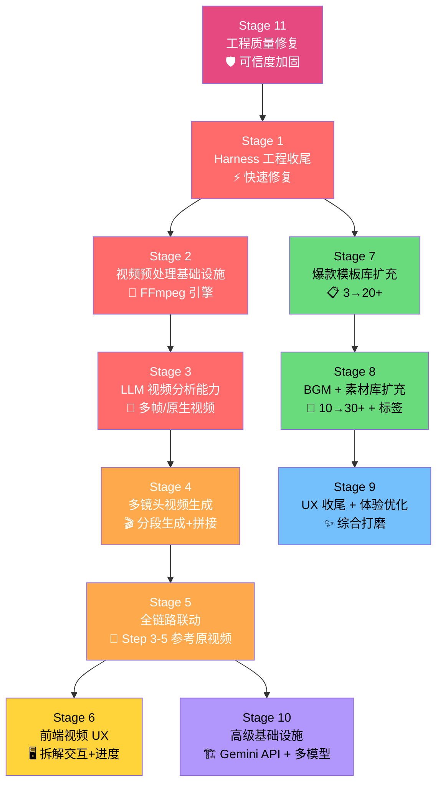
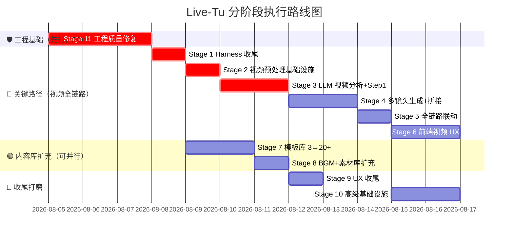

# Live-Tu 全方位改进计划 v2 — 分阶段执行 × 逐阶段验收

> 基于 **git 实际代码审计**（非 commit message 声称），整合视频全链路、Harness 增强、内容库扩充、工程质量修复，切分为 **11 个可独立执行的 Stage**。每个 Stage 由一个独立会话完成，完成后验收再启动下一个。

---

## 📋 代码实际状态审计

> [!IMPORTANT]
> 以下是 git HEAD (`4a30013`) 的**真实实现状态**，而非 commit message 声称的状态。

| 改进项 | commit 声称 | 实际状态 | 证据 |
|:---|:---|:---|:---|
| HARNESS_CONSTRAINTS 全 Step 注入 | ✅ 已完成 | ✅ **确认完成** | Steps 1-4 全部注入 `JSON_ONLY`/`STRUCTURED_OUTPUT`/`SAFETY`/`SELF_CRITIQUE`/`FEW_SHOT` |
| Zod Schema + Self-Correction | ✅ 已完成 | ✅ **确认完成** | `schema-validators.ts` 已创建，`executeWithSelfCorrection` 在所有 Step 调用 |
| `response_format: json_object` | ✅ 已完成 | ✅ **确认完成** | `llm-gateway.ts` L102 已添加 |
| Few-Shot 去品牌化 | ✅ 已完成 | ⚠️ **大部分完成** | Step 1/2 已用 `[Product]` 占位，但 `getProductContext()` fallback 仍硬编码 `'BUV 笔薇 小绿泥洁面'`，mock 数据也含硬编码 |
| 违禁词前置 + 自纠错 | ✅ 已完成 | ✅ **确认完成** | Step 3 system prompt 已注入违禁词列表，检测到违规自动重试 |
| BGM 预筛选 | ✅ 已完成 | ✅ **确认完成** | Step 4 按 mood/style_tags SQL 预筛，LIMIT 15 |
| Step 2 传图给 LLM | 未提及 | ❌ **未实现** | `executeWithSelfCorrection` 第4参数传 `undefined`，视觉信息丢失 |
| Mock 回退策略优化 | 未提及 | ❌ **未改** | `ALLOW_MOCK_FALLBACK` 仍静默回退，用户无法区分 |
| 预设模板 3→19 | ✅ 17个新增 | ❌ **仅 3 个** | `defaultPresets` 数组只有 3 条 seed |
| BGM 4→24+ | ✅ 20+新增 | ⚠️ **10 条** | `initialBgmList` 有 10 条（比原来 4 条多了 6 条，但远未达标）|
| 会话管理激活 | ✅ 已完成 | ✅ **确认完成** | `SessionManagerModal` 已挂载，Navbar 有工作区指示器 |
| 素材 ffprobe 元信息 | ✅ 已完成 | ❌ **未实现** | 无 ffprobe 调用，duration 仍硬编码 |
| 爆款视频目录导入 | ✅ 已完成 | ❌ **未实现** | 无导入逻辑 |
| 素材标签系统 | ✅ 已完成 | ❌ **未实现** | materials 表无 tags 字段操作 |

---

## 🏗️ Stage 分阶段执行计划



---

## Stage 1: Harness 工程收尾 + Pipeline 质量修复

> **目标**：修复代码审计中发现的遗留问题，确保现有 pipeline 输出质量稳定。
> **复杂度**：🟢 低 | **估时**：1 个会话

### 范围

| # | 改动 | 文件 | 说明 |
|:--|:---|:---|:---|
| 1.1 | Step 2 传图给 LLM | [pipeline.ts](file:///d:/code/Live-Tu/app/server/routes/pipeline.ts) L427 | 将 `undefined` 改为 `targetImageUrl`，让运镜 LLM 能看到首帧图 |
| 1.2 | `getProductContext` fallback 去硬编码 | [pipeline.ts](file:///d:/code/Live-Tu/app/server/routes/pipeline.ts) L81-95 | 将 `'BUV 笔薇 小绿泥洁面'` 改为 `'默认产品'`，mock 数据同理 |
| 1.3 | Mock 回退策略优化 | [pipeline.ts](file:///d:/code/Live-Tu/app/server/routes/pipeline.ts) | `ALLOW_MOCK_FALLBACK=true` 时，response 增加 `source: 'mock'` 前端醒目标注 |
| 1.4 | BGM 预筛增加 BPM 范围过滤 | [pipeline.ts](file:///d:/code/Live-Tu/app/server/routes/pipeline.ts) L656-666 | 在 mood 筛选基础上加 BPM 范围过滤 |
| 1.5 | Harness Prompt 层级化 | [pipeline.ts](file:///d:/code/Live-Tu/app/server/routes/pipeline.ts) | 将 Global/Step-Specific/Dynamic Context 三层清晰分离 |

### 交付物
- 修改后的 `pipeline.ts`
- 3 次端到端 Pipeline 运行验证（不同产品）

### 验收标准
- [ ] Step 2 LLM 调用传入图片 URL（非 undefined）
- [ ] 切换到非 BUV 产品后，输出中无 "BUV"/"小绿泥" 泄漏
- [ ] Mock 回退时前端可区分（`source: 'mock'` 标记）
- [ ] BGM 推荐按 BPM 范围预筛后再注入 prompt

---

## Stage 2: 视频预处理基础设施

> **目标**：建立服务端视频处理能力，为后续视频分析打地基。
> **复杂度**：🟡 中 | **估时**：1 个会话

### 范围

| # | 改动 | 文件 | 说明 |
|:--|:---|:---|:---|
| 2.1 | 视频预处理引擎 | [NEW] `server/lib/video-preprocessor.ts` | FFmpeg 场景检测切分、关键帧提取、音频轨提取、元信息解析 |
| 2.2 | 视频预处理 API | [NEW] `server/routes/video.ts` | `POST /api/video/preprocess`、`GET /api/video/keyframes/:id` |
| 2.3 | 素材上传 ffprobe 增强 | [MODIFY] `server/routes/materials.ts` | 上传视频时自动 ffprobe 提取精确 duration/resolution/fps |
| 2.4 | DB 新增缓存表 | [MODIFY] `server/lib/db.ts` | 新增 `video_preprocess_cache` 表 |
| 2.5 | 爆款视频一键导入 | [MODIFY] `server/routes/materials.ts` | `POST /api/materials/import-directory` 导入 `爆款视频/` 目录 |

### 交付物
- `video-preprocessor.ts` 引擎模块
- `video.ts` API 路由
- materials 上传增强
- 爆款视频目录成功导入素材库

### 验收标准
- [ ] 上传一个 30s MP4 → ffprobe 提取精确时长/分辨率
- [ ] `/api/video/preprocess` 返回场景分段 + 关键帧图片 URL 列表
- [ ] `爆款视频/` 中 8 个文件全部导入素材库并显示缩略图
- [ ] 预处理结果缓存在 SQLite，重复请求直接返回缓存

---

## Stage 3: LLM 视频分析 + Step 1 视频拆解升级

> **目标**：Step 1 从「单帧分析」升级为「视频级多模态拆解」。
> **复杂度**：🔴 高 | **估时**：1 个会话

### 范围

| # | 改动 | 文件 | 说明 |
|:--|:---|:---|:---|
| 3.1 | LLM Gateway 多帧输入 | [MODIFY] `server/lib/llm-gateway.ts` | 支持 `imageUrls: string[]` 多图输入 |
| 3.2 | Step1Output 模型扩展 | [MODIFY] `src/types.ts` | 新增 `VideoDeconstructionOutput`（shotList、videoStructure、originalScript、audioAnalysis） |
| 3.3 | Step 1 后端视频拆解 | [MODIFY] `server/routes/pipeline.ts` | `/step1` 检测视频输入 → 调用预处理 → 多帧传 LLM → 输出镜头表 |
| 3.4 | Zod Schema 扩展 | [MODIFY] `server/lib/schema-validators.ts` | 新增 `VideoDeconstructionOutputSchema` |
| 3.5 | Step 1 前端视频拆解展示 | [MODIFY] `src/components/Step1Card.tsx` | 视频拆解结果展示（镜头表、时间轴、结构分析） |

### 交付物
- 增强的 LLM Gateway（多帧模式）
- Step 1 视频拆解完整实现（后端 + 前端）

### 验收标准
- [ ] 上传 `李响-005-0702-绿泥洗面奶吓人.MOV` → Step 1 输出包含 `shotList`（≥3 个镜头段）
- [ ] 上传普通图片 → 仍走原有逻辑（向下兼容）
- [ ] 前端展示镜头时间轴 + 每段缩略帧
- [ ] Zod 校验通过率 ≥ 95%

---

## Stage 4: Step 2 多镜头视频生成 + 镜头拼接

> **目标**：基于 Step 1 镜头表，逐镜头生成视频片段并拼接。
> **复杂度**：🔴 高 | **估时**：1 个会话

### 范围

| # | 改动 | 文件 | 说明 |
|:--|:---|:---|:---|
| 4.1 | 多镜头生成策略 | [MODIFY] `server/routes/pipeline.ts` `/step2` | 基于 shotList 逐镜头生成首帧 + 调用 Seedance |
| 4.2 | 多镜头任务追踪 | [MODIFY] `server/lib/db.ts` | 新增 `shot_generation_tasks` 表 |
| 4.3 | FFmpeg 镜头拼接 | [MODIFY] `server/routes/render.ts` | 多片段 concat + crossfade 转场 |
| 4.4 | 前端多镜头进度 | [NEW] `src/components/ShotGenerationTracker.tsx` | 逐镜头状态追踪 UI |

### 交付物
- Step 2 多镜头生成完整实现
- FFmpeg 镜头拼接能力
- 前端进度追踪组件

### 验收标准
- [ ] Step 1 输出 5 段镜头 → Step 2 为每段生成视频片段
- [ ] FFmpeg 拼接 3+ 片段为连续视频，转场自然
- [ ] 前端显示每个镜头的生成状态（pending/generating/completed/failed）

---

## Stage 5: Pipeline 全链路联动（Step 3-5 参考原视频）

> **目标**：Step 3-5 利用 Step 1 视频拆解的丰富信息，提升产出质量。
> **复杂度**：🟡 中 | **估时**：1 个会话

### 范围

| # | 改动 | 文件 | 说明 |
|:--|:---|:---|:---|
| 5.1 | Step 3 参考原视频文案风格 | [MODIFY] `pipeline.ts` `/step3` | 当有 `originalScript` 时注入文案风格参考 |
| 5.2 | Step 4 参考原视频音乐节奏 | [MODIFY] `pipeline.ts` `/step4` | 当有 `audioAnalysis` 时按 BPM/风格匹配 |
| 5.3 | Step 5 多镜头 Timeline 编排 | [MODIFY] `pipeline.ts` `/step5` | 基于 shotList + 多片段自动构建 timeline |
| 5.4 | Step 5 合成增强 | [MODIFY] `server/routes/render.ts` | 多片段视频轨 + 字幕按镜头对齐 |

### 交付物
- Step 3-5 全部升级为视频感知模式

### 验收标准
- [ ] 视频拆解模式下 Step 3 文案风格与原视频一致
- [ ] Step 4 推荐 BGM 的 BPM 与原视频 BPM 偏差 ≤20%
- [ ] Step 5 Timeline 正确包含多个视频片段
- [ ] 端到端：上传爆款视频 → 完整 5 步 → 输出成品视频

---

## Stage 6: 前端视频拆解 UX

> **目标**：全新的视频拆解交互体验。
> **复杂度**：🟡 中 | **估时**：1 个会话

### 范围

| # | 改动 | 文件 | 说明 |
|:--|:---|:---|:---|
| 6.1 | 视频上传进度 + 预处理状态 | [MODIFY] `Step1Card.tsx` | 大文件上传进度条 + 预处理动画 |
| 6.2 | 视频拆解结果组件 | [NEW] `VideoDeconstructionView.tsx` | 时间轴视图、镜头详情面板 |
| 6.3 | 智能模式切换 | [MODIFY] `Step1Card.tsx` | 根据文件类型自动切换图片/视频模式 |
| 6.4 | Step 5 成品预览增强 | [MODIFY] `Step5Card.tsx` | 多片段预览 + 镜头顺序调整 |

### 交付物
- 完整的视频分析前端交互

### 验收标准
- [ ] 上传视频时显示进度条和预处理状态
- [ ] 拆解结果以时间轴形式展示，可点击查看每段详情
- [ ] 上传图片自动走图片模式，上传视频自动走视频模式

---

## Stage 7: 爆款模板库高品质精雕（8 大行业黄金爆款公式模板库）

> **目标**：不追求盲目数量堆砌，而是严格基于 `爆款视频/` 目录下 8 条实际样本的视听拆解，精雕 **8 大黄金爆款公式模板**（每种风格 1 个大师级示范），提供包含全链路 5 步精细化 Pipeline 示例数据。
> **复杂度**：🟡 中 | **估时**：1 个会话

### 核心约束与要求

1. **真实视听拆解约束**：8 个 Preset 必须一对一深度参考 `爆款视频/` 目录下的真实视频特征（包括镜头切变、128BPM 重低音卡点、SGS 权威数据标红、具象测量道具、前后蜕变叙事、60FPS 流畅视觉）。
2. **完全通用原则 (No Brand Leakage)**：模板数据中**严禁硬编码任何特定品牌或品类名称**（如 `BUV`、`笔薇`、`小绿泥`、`薄荷`），必须使用通用产品变量 `${product.name}`、`${product.positioning}`、`[Product]` 占位，确保适用于洗面奶、吹风机、服装、数码等任意产品。
3. **5 步全链路完整性约束**：每个 Preset 的 `pipeline_data` 必须包含合法、完整的 Step 1~5 真实数据：
   - Step 1: 包含 `shotList` 镜头表、`videoStructure` 叙事弧线、`originalScript` 口播参考、`audioAnalysis` BPM 节奏。
   - Step 2: 包含运镜 Prompt、Camera 移动参数、`isMultiShot` 多镜头生成配置。
   - Step 3: 包含高转化文案标题、黄金 3 秒 Hook、正文与平台适配口播。
   - Step 4: 包含与原视频 BPM (如 128BPM) 精准契合的 BGM 检索参数与推荐曲目。
   - Step 5: 包含带有时间区间控制（`startSec`/`endSec`）的字幕 Timeline。

### 范围与对应关系

| Preset ID | 爆款公式风格 | 对应实战样本 | 核心视听特征与镜头安排 |
|:---|:---|:---|:---|
| `preset_3s_hook` | 🔥 **【3秒反差惊悚吸睛】** | `李响-005-绿泥洗面奶吓人.MOV` (86.8s) | 前3秒高反差视觉Hook；中段质感拉丝与打泡；结尾强转化引导 |
| `preset_before_after` | 🆚 **【清水 vs 产品 对比冲击】** | `赖雨华-0701-清水洗脸24.mp4` (88.0s) | 左右分屏实验对比；吸油纸测试证明清水局限；数据化视觉证明 |
| `preset_morning_routine` | 🌿 **【治愈晨间 Routine 沉浸】** | 小红书护肤 Vlog 样本 | 柔和晨间自然光；高润泽肌肤质感；舒缓 Lofi 音效沉浸感 |
| `preset_sgs_science` | 📊 **【SGS 科学数据硬核背书】** | `0716-毛孔2-1.mp4` (67.9s) | 3D/微距毛孔角质层放大；SGS 权威检测报告大字标红背书 |
| `preset_128bpm_beat` | 🎵 **【128BPM 卡点极速测评】** | `李响-018-三厘米.mp4` (65.6s) | 3cm 刻度尺/针头具象道具对比；128BPM 重低音强卡点节奏 |
| `preset_emotional_story` | 💕 **【前后蜕变叙事与情绪共鸣】** | `郭海艳-0709-去年的我1.mp4` (78.3s) | 第一人称 Vlog 叙事；去年的我 vs 现在的我前后对比与真实情感 |
| `preset_brand_trust` | 🏆 **【品质信任品牌故事】** | 沙利文第一认证真实案例 | 视频号高客单；高级暗调光影；品牌历史与销量行业第一认可 |
| `preset_asmr_macro` | 🎤 **【ASMR 极致微距质感展示】** | `黎晓晓-0704-AI歌曲.mp4` (32.3s 60FPS) | 60FPS 超流畅微距摄影；纯水滴/膏体音效；视听双重沉浸 |

### 涉及文件
- `[MODIFY] app/server/lib/db.ts`: 将 `defaultPresets` 彻底重构为以上 8 个符合约束的高品质 Preset。
- `[MODIFY] app/src/views/PresetsPageView.tsx`: 增加按 8 大爆款公式风格筛选 Tab 与 Preview 预览模态框。
- `[MODIFY] app/src/components/Sidebar.tsx`: 增加 8 大公式徽章分类。

### 验收标准
- [ ] 数据库 `presets` 表精确包含以上 8 个高品质示范 Preset
- [ ] 所有 Preset 的 JSON 中全网检索不到任何硬编码品牌（`BUV`/`小绿泥`）
- [ ] 任意 Preset 载入工作台后，Step 1~5 均具备可直接运行与渲染的真实数据
- [ ] 界面支持按 8 大爆款公式分类筛选与 Preview Preview

---

## Stage 8: BGM 曲库扩充（10→30+）+ 素材库优化

> **目标**：BGM 从 10 条扩到 30+，素材库增加标签系统和元信息自动提取。
> **复杂度**：🟡 中 | **估时**：1 个会话

### 范围

| # | 改动 | 文件 | 说明 |
|:--|:---|:---|:---|
| 8.1 | BGM 分类标准化 | [MODIFY] `server/lib/db.ts` | 6 大分类（治愈Lofi/轻快Pop/卡点Electronic/品质Ambient/节奏R&B/ASMR） |
| 8.2 | 新增 20+ BGM seed | [MODIFY] `server/lib/db.ts` | 每分类至少 5 首，替换 SoundHelix 外链 |
| 8.3 | BGM UI 分类筛选 | [MODIFY] `BgmPageView.tsx` | 按分类/BPM/情绪筛选 |
| 8.4 | 素材标签系统 | [MODIFY] `server/routes/materials.ts` | 标签 CRUD + 按标签筛选 |
| 8.5 | 素材元信息自动提取 | [MODIFY] `server/routes/materials.ts` | ffprobe 提取精确 duration/resolution |

### 交付物
- 30+ BGM 条目（标准化分类）
- 素材标签系统
- 素材 ffprobe 元信息

### 验收标准
- [ ] BGM 库 ≥ 30 条，6 个分类各 ≥ 5 条
- [ ] BGM 按分类/BPM 筛选正常
- [ ] 素材支持添加/查询标签
- [ ] 上传视频后自动显示精确时长

---

## Stage 9: UX 会话管理收尾 + 综合体验优化

> **目标**：补齐会话管理的细节 + 整体 UX 打磨。
> **复杂度**：🟢 低 | **估时**：1 个会话

### 范围

| # | 改动 | 文件 | 说明 |
|:--|:---|:---|:---|
| 9.1 | 会话管理搜索/筛选 | [MODIFY] `SessionManagerModal.tsx` | 按名称搜索、按状态筛选 |
| 9.2 | Navbar 最近工作区下拉 | [MODIFY] `Navbar.tsx` | 点击工作区指示器展开最近 5 个 |
| 9.3 | 遗留死代码清理 | [MODIFY] `App.tsx` | 清理不再使用的旧会话相关代码 |
| 9.4 | Onboarding 引导优化 | [MODIFY] `OnboardingModal.tsx` | 更新引导流程包含视频上传 |
| 9.5 | 一键清空工作台 | [MODIFY] `App.tsx` + `Sidebar.tsx` | 确认「一键清空工作台」按钮正常工作 |

### 交付物
- 完善的会话管理体验
- 清理后的代码

### 验收标准
- [ ] 搜索/筛选工作区正常
- [ ] 最近工作区快速切换正常
- [ ] 无死代码和未使用的 import

---

## Stage 10: 高级基础设施（Gemini File API + 异步任务 + 多模型）

> **目标**：接入 Gemini 原生视频分析能力，建立统一的视频生成网关。
> **复杂度**：🔴 高 | **估时**：1 个会话

### 范围

| # | 改动 | 文件 | 说明 |
|:--|:---|:---|:---|
| 10.1 | Gemini File API 集成 | [NEW] `server/lib/gemini-file-api.ts` | 视频上传 → file URI → 原生视频分析 |
| 10.2 | LLM Gateway 原生视频模式 | [MODIFY] `server/lib/llm-gateway.ts` | 支持 Gemini `fileData` 格式 |
| 10.3 | 视频生成网关 | [NEW] `server/lib/video-generation-gateway.ts` | 统一 Seedance/Kling/Veo 接口 |
| 10.4 | 异步任务管理增强 | [MODIFY] `server/routes/tasks.ts` | 通用异步任务状态追踪框架 |
| 10.5 | 模型配置中心扩展 | [MODIFY] `ModelConfigCenterModal.tsx` | 支持配置视频生成模型 |

### 交付物
- Gemini 原生视频分析能力
- 统一的视频生成网关
- 通用异步任务框架

### 验收标准
- [ ] Gemini File API 上传视频成功 → 获取 file URI
- [ ] 原生视频分析比多帧分析输出更详细的镜头信息
- [ ] 视频生成网关支持动态选择 Seedance/Kling

---

## Stage 11: 工程质量修复（CI 可信度 + 数据安全 + 前端债务）

> **目标**：让「测试全绿」变回真实信号，修复重启丢配置的数据行为，清除前端类型/死代码债务，补完运维闭环（备份调度/容器字体/配置入库）。
> **优先级**：🔴 **P0 先行** —— 本 Stage 是其余所有功能 Stage 的信任基础（假绿测试会让任何后续验收失真）
> **复杂度**：🟡 中 | **估时**：2–3 个会话 | **审计日期**：2026-08-04（全仓工程审计）

### 背景（审计结论摘要）

```
假绿测试       10 个测试文件用 console.assert 当断言 → 失败静默通过，CI 半虚绿
测试零检查     tsconfig exclude "server/test" → 测试代码不被 tsc 检查
重启丢配置     db.ts 每次启动强制重跑"迁移" → 覆盖用户模型配置（重启即还原）
前端债务       115 处 any / ~2,500 行死代码 / 4 处轮询互踩（Step2 超时保护永不生效）
运维断链       备份脚本无调度器、容器缺 CJK 字体、.env.production.example 被 gitignore 误杀
```

### 范围

| # | 改动 | 文件 | 说明 | 优先级 |
|:--|:---|:---|:---|:---|
| 11.1 | CI 补跑高质量单测 | `.github/workflows/ci.yml` | 增加 `npm run test:materials-ux` + `npm run test:dual-gate`——已写好、质量最高却从未进 CI 的两套测试 | P0 |
| 11.2 | 修复假测试 | `server/test/*.test.ts`（10 个文件） | `console.assert` → `node:assert/strict` + `test()`；无法修复的孤儿测试直接删除；全部接入 npm script | P0 |
| 11.3 | 测试纳入类型检查 | `app/tsconfig.json:26` | 移除 `exclude: ["server/test"]` | P0 |
| 11.4 | 修复启动时覆盖用户数据 | `server/lib/db.ts:879-943` | `realModels` upsert + `is_default` 强制重置改为一次性迁移（进 `schema_migrations`），否则用户模型配置每次重启被还原 | P0 |
| 11.5 | 合并双份模型种子 | `server/lib/db.ts:721-743, 919-932` | `initialModels`/`realModels` 两份几乎相同的列表合并为单一事实源 | P1 |
| 11.6 | 演示数据不进生产 | `server/lib/db.ts:636-866` | 空库演示任务（`task_seed_*`）与 Unsplash 外链产品种子加 `NODE_ENV !== 'production'` 条件；模型/BGM/预设种子属功能默认值，保留但迁移语义一次性化（见 11.4） | P1 |
| 11.7 | 修复轮询超时失效 | `src/components/Step2Card.tsx:177-262` | effect 每次 tick 改 status → interval 重建 → `attempts` 归零 → `maxAttempts=60` 永不生效；修复后超时保护真实生效 | P0 |
| 11.8 | tsconfig 开 strict | `app/tsconfig.json` + `app/src` | `strict: true`，按审计清单逐条清理 115 处 `any`/`as any` | P1 |
| 11.9 | 删除死代码 | `src/`（5 个零引用 Modal + `ui/` 8 组件 + `runFullPipelineAutoLegacy` + 2 个死 handler） | 约 2,500 行（占全库 ~14%） | P1 |
| 11.10 | fetch 收敛 + 错误约定统一 | `src/services/api.ts` + 12 处直连 fetch 调用点 | 统一走 apiService、统一 `API_BASE_URL`；错误处理收敛为单一约定（当前 4 种混用：抛异常/吞错/`{success:false}`/null） | P1 |
| 11.11 | 统一轮询 hook | 新增 `usePolling` + 4 处轮询调用点 | 合并轮询逻辑；任务轮询加版本号/序号防「后返回覆盖先返回」 | P1 |
| 11.12 | Node 版本约束 + 锁文件清理 | `app/package.json` | 补 `engines: { node: ">=24" }`（代码用 `node:sqlite`，Node <23.4 需 flag / Node 20 直接崩）；删除过期双锁文件 `bun.lock` | P1 |
| 11.13 | 容器 CJK 字体 + BACKUP_DIR | `app/Dockerfile`、`app/compose.yml` | 装 `fonts-noto-cjk`（当前容器内中文字幕 drawtext 断链）；开发 compose 补 `BACKUP_DIR` 指向备份卷（当前备份落容器层，重建即丢） | P1 |
| 11.14 | 配置入库补全 | `app/.gitignore`、`.env.example`、`deploy/.env.production.example` | 放行 `!deploy/.env.production.example`（RUNBOOK 第一步引用，新克隆即缺失）；example 补 `BACKUP_DIR`/`APP_PUBLIC_URL`/`FFMPEG_FONTFILE`/`FFMPEG_PATH`/`IMAGE_MODEL`/`PIPELINE_*` 等 10+ 键 | P1 |
| 11.15 | 定时备份 + 恢复演练脚本化 | `.github/workflows/ci.yml`（schedule）或服务器 cron + `app/scripts/` | `backup.mjs` 写得很好但没有调度器 = 没有备份；恢复演练从临时目录升级为真实卷回演脚本 | P2 |
| 11.16 | 密钥轮换 + 仓库治理 | 运维动作 + `.gitignore` | 轮换并删除 `docs/云雾.txt` 明文密钥；清 `.scratch/` 入库残留（10 个文件）、失效 gitlink（`reference/repo/*` 无 `.gitmodules`） | P2 |
| 11.17 | 巨型组件拆分 | `src/App.tsx`（2583 行）、`src/components/Step1Card.tsx`（2059 行） | 先抽公共 Modal（全库 17 处 `fixed inset-0` 覆盖层重复）+ 状态收敛（zustand/context）再拆文件 | P2 |

### 交付物
- CI 全绿，且每条绿都是真实断言（全仓无 `console.assert` 测试残留）
- 重启服务不再覆盖用户模型配置（伪迁移一次性化）
- 前端 `strict` 通过、死代码清零、轮询单一实现
- 容器内中文字幕可渲染、备份可由调度器触发、新克隆部署 RUNBOOK 第一步可用

### 验收标准
- [ ] `npm run lint` 覆盖 `server/test`（移除 exclude 后类型错误清零）
- [ ] CI 包含 materials-ux 与 dual-gate；全仓 grep 无 `console.assert` 测试残留
- [ ] 修改模型配置 → 重启服务 → 配置保留（`db.ts` 伪迁移已删除或一次性化）
- [ ] 全新生产库（`NODE_ENV=production`）无演示任务/演示产品
- [ ] Step2 轮询超过 60 tick 后确实中止（修复前永不中止）
- [ ] `tsc --noEmit` 在 strict 模式下通过，`app/src` 无 `any` 断言残留
- [ ] 容器内中文字幕 drawtext 渲染正常（字体链完整）
- [ ] 备份产物出现在 `BACKUP_DIR` 挂载卷；恢复演练脚本可一键跑通
- [ ] 新克隆仓库按 RUNBOOK 第一步可找到 `.env.production.example`

---

## 执行路线图



### 三条执行轨道

- **工程基础**：Stage 11（工程质量修复）**先行**——假绿测试会让所有后续验收失真，重启丢配置会在生产放量时成为数据事故；P0 项完成前不建议启动功能 Stage
- **关键路径**：Stage 1 → 2 → 3 → 4 → 5 → 6（视频全链路，串行依赖）
- **内容扩充**：Stage 7 → 8（可在 Stage 1 完成后并行启动）
- **收尾**：Stage 9、10 在各自前置完成后执行

### 执行方式

每个 Stage 由你派出一个独立会话去执行：
1. 你把本计划中对应 Stage 的内容作为 prompt 发给新会话
2. 新会话完成后，你回来验收（对照验收标准逐项检查）
3. 验收通过 → 启动下一个 Stage
4. 验收不通过 → 同一会话继续修复，或开新会话专项修复

> [!TIP]
> **Stage 7-8**（内容库扩充）与 **Stage 2-6**（视频链路）互不依赖，可以并行进行。建议先启动 Stage 1，完成后同时启动 Stage 2 和 Stage 7。
